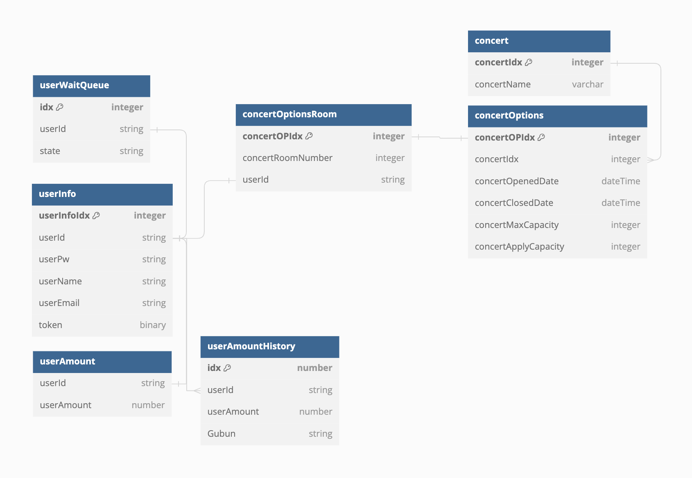

# API 명세서

## 개요

이 API는 콘서트 예약 서비스의 RESTful API입니다.

## 기본 URL

<!-- `https://api.example.com/v1` -->

## 인증

API 요청에는 모든 엔드포인트에 대해 Bearer Token 인증이 필요합니다.

<details>
  <summary><span style="font-size: 1.5em;">캐시 전략 관련 보고서</span></summary>

### 캐시 전략 분석

#### 1. 캐싱이란 \*nest.js 공식문서 발췌

    - 캐싱은 앱의 성능을 향상시킬 수 있는 훌륭하면서도 간단한 테크닉 입니다.
    - 캐싱은 고성능 데이터 액세스를 제공하는 임시 데이터 저장소 역할을 합니다.

#### 2. 캐싱의 필요성

    (1) DB I/O 를 줄인다.
    (2) 응답시간을 단축시킨다.
      - 현재 API 중 가장 DB I/O가 빈번하게 일어날 것 같은 API -> 콘서트 조회 API

#### 3. 콘서트 조회 API

    - API 조회 되는 시점에서 Cache 생성
    - 콘서트 및 상세내용이 수정 되는 시점에서 Cache 폭파
    - API 조회 시 Cache 확인, Cache가 존재하지 않는 경우 신규 Cache 보여주기

#### 개발된 API 중 콘서트 조회 API만 선택한 이유

    1. 고려된 API는 총 3가지
      1) 콘서트 조회
      2) 유저 데이터 조회
        - 현업에서 유저 정보의 경우 userName이나 세션 ID같은 부분을 암호화로 FE에 제공하는 것으로 이해
      3) 대기열
        - 대기열을 redis로 변경했기 때문에 캐싱을 하는 것은 의미 없는 짓이라고 생각함.

</details>

<details>
  <summary><span style="font-size: 1.5em;">유즈케이스 분석 자료</span></summary>

### 유즈케이스 분석

- 유저 대기열 토큰 발급

  - 문제 : 다수의 유저가 동시에 대기열 토큰을 요청할 경우, 동일한 대기 순서가 부여되거나 데이터 충돌이 발생할 수 있습니다.
  - 해결 : 대기열의 경우 분산환경, 데이터 일관성, 성능 유지를 위해 Redis의 Simple lock를 고려했습니다.
  - 추가 : Redis 서버 에러를 고려해야 한다는 생각도 하는중입니다.

- 좌석 예약 요청

  - 문제 : 동일한 좌석에 대해 다수의 유저가 동시에 예약 요청을 할 경우, 두 명 이상의 유저에게 동일한 좌석이 임시 예약 상태로 제공될 수 있습니다.
  - 해결 : 충돌 빈도가 토큰 발급 보다 상대적으로 낮다고 생각, 낙관락 + 재시도를 통해 최적화를 진행하는 것 고려했습니다.

- 결제 API
  - 문제 : 동일한 좌석에 대해 다수의 유저가 결제 요청을 할 경우, 두 명 이상의 유저에게 동일한 좌석이 결제 완료 상태로 배정될 수 있습니다.
  - 해결 : 결제의 경우 데이터 일관성을 보장 하기 위해 비관락을 고려했습니다.

</details>

<details>
  <summary><span style="font-size: 1.5em;">API Spec</span></summary>

### 유저 토큰 발급 API

- 로그인
- 로그아웃
- 유저 조회
- 유저 전체 조회
<!-- - 토큰 발급 -->

### 예약 가능 날짜 / 좌석 API

- 콘서트 조회
- 콘서트 등록
- 콘서트 삭제
- 예약 가능 날짜 조회
- 예약 가능 날짜 별 좌석 조회

### 좌석 예약 요청 API

- 예약 가능 날짜 별 좌석 예약
- 좌석 예약 취소 요청

### 잔액 충전 / 조회 API

- 잔액 조회
- 잔액 충전

### 결제 API

- 결제 요청
</details>

<details>
  <summary><span style="font-size: 1.5em;">엔드포인트</span></summary>

### 유저 토큰 발급 API

#### 로그인

##### EndPoint

- **URL**: `/login`
- **Method**: `POST`
- **Description**: 로그인 기능

##### Request

- **Headers**:
  - `Authorization`: `Bearer {token}`
  - `Content-Type`: `application/json`
- **Body**:
  ```json
  {
    "userId": "string",
    "password": "string"
  }
  ```

##### Response

- **Success(201)**:
  ```json
  {
    "userId": "string",
    "token": "jwt토큰"
  }
  ```
- **Error(400)**:
  ```json
  {
    "error": "400",
    "message": "Invalid input data"
  }
  ```

##### Error

- 400 : 잘못된 요청
- 401 : 인증 실패
- 403 : 접근 권한 없음
- 404 : 리소스 없음
- 500 : 서버 오류

#### 로그아웃

##### EndPoint

- **URL**: `/logout`
- **Method**: `POST`
- **Description**: 로그아웃 기능

##### Request

- **Headers**:
  - `Authorization`: `Bearer {token}`
  - `Content-Type`: `application/json`
- **Body**:
  ```json
  {
    "userId": "string"
  }
  ```

##### Response

- **Success(201)**:
  ```json
  {
    "token": null
  }
  ```

#### 유저 조회

##### EndPoint

- **URL**: `/getUserInfo`
- **Method**: `POST`
- **Description**: 특정 유저 조회

##### Request

- **Headers**:
  - `Authorization`: `Bearer {token}`
  - `Content-Type`: `application/json`
- **Body**:
  ```json
  {
    "userId": "string"
  }
  ```

##### Response

- **Success(201)**:
  ```json
  {
    "userId": "string",
    "userName": "string",
    "userEmail": "string",
    "token": "string"
  }
  ```
- **Error(404)**:
  ```json
  {
    "error": 404,
    "message": "Not found"
  }
  ```

#### 유저 전체 조회

##### EndPoint

- **URL**: `/getUserInfoAll`
- **Method**: `POST`
- **Description**: 전체 유저 조회

##### Request

- **Headers**:
  - `Authorization`: `Bearer {token}`
  - `Content-Type`: `application/json`
- **Body**:
  ```json
  {}
  ```

##### Response

- **Success(201)**:
  ```json
  [
    {
      "userId": "string",
      "userName": "string",
      "userEmail": "string",
      "token": "string"
    },
    {
      "userId": "string",
      "userName": "string",
      "userEmail": "string",
      "token": "string"
    },
    {
      "userId": "string",
      "userName": "string",
      "userEmail": "string",
      "token": "string"
    }
  ]
  ```
- **Error(404)**:
  ```json
  {
    "error": 404,
    "message": "Not found"
  }
  ```

<!-- #### 유저 토큰 발급

##### EndPoint

- **URL**: `/setToken`
- **Method**: `POST`
- **Description**: 토큰 발급

##### Request

- **Headers**:
  - `Authorization`: `Bearer {token}`
  - `Content-Type`: `application/json`
- **Body**:
  ```json
  {
    "userId": "string"
  }
  ```

##### Response

- **Success(201)**:
  ```json
  {
    "userId": "string",
    "token": "string"
  }
  ``` -->

### 예약 가능 날짜 / 좌석 API

#### 콘서트 조회

##### EndPoint

- **URL**: `/getConcert`
- **Method**: `POST`
- **Description**: 전체 콘서트를 조회

##### Request

- **Headers**:
  - `Authorization`: `Bearer {token}`
  - `Content-Type`: `application/json`
- **Body**:
  ```json
  {
    "concertName": "string"
  }
  ```

##### Response

- **Success(201)**:

  ```json
  [
    {
      "concertName" : "string",
      "concertOpenedDate" : "dateTime",
      "concertClosedDate" : "dateTime",
      "concertMaxCapacity" : number,
      "concertApplyCapacity" : number
    },
    {
      "concertName" : "string",
      "concertOpenedDate" : "dateTime",
      "concertClosedDate" : "dateTime",
      "concertMaxCapacity" : number,
      "concertApplyCapacity" : number
    }
  ]

  ```

- **Error(404)**:
  ```json
  {
    "error": "404",
    "message": "Not Found"
  }
  ```

#### 콘서트 등록

##### EndPoint

- **URL**: `/setConcert`
- **Method**: `POST`
- **Description**: 콘서트 등록

##### Request

- **Headers**:
  - `Authorization`: `Bearer {token}`
  - `Content-Type`: `application/json`
- **Body**:
  ```json
  {
    "concertName" : "string",
    "concertOpenedDate" : "dateTime",
    "concertClosedDate" : "dateTime",
    "concertMaxCapacity" : number
  }
  ```

##### Response

- **Success(201)**:

  ```json
  {
    "concertId": number,
    "concertName" : "string",
    "concertOpenedDate" : "dateTime",
    "concertClosedDate" : "dateTime",
    "concertMaxCapacity" : number,
    "concertApplyCapacity" : number
  }
  ```

#### 콘서트 삭제

##### EndPoint

- **URL**: `/delConcert`
- **Method**: `POST`
- **Description**: 콘서트 삭제

##### Request

- **Headers**:

  - `Authorization`: `Bearer {token}`
  - `Content-Type`: `application/json`

- **Body**:
  ```json
  {
    "concertName": "string",
    "concertOpenDate": "dateTime"
  }
  ```

##### Response

- **Success(201)**:

  ```json
  {
    "result" : boolean
  }
  ```

- **Error(404)**:
  ```json
  {
    "error": "404",
    "message": "Not Found"
  }
  ```

#### 예약 가능 날짜 조회

##### EndPoint

- **URL**: `/getConcertDate`
- **Method**: `POST`
- **Description**: 예약 가능 날짜 조회

##### Request

- **Headers**:

  - `Authorization`: `Bearer {token}`
  - `Content-Type`: `application/json`

- **Body**:
  ```json
  {
    "concertName": "string"
  }
  ```

##### Response

- **Success(201)**:

  ```json
  [
    {
      "concertName" : "string",
      "concertOpenedDate" : dateTime
    },
    {
      "concertName" : "string",
      "concertOpenedDate" : dateTime
    },
    {
      "concertName" : "string",
      "concertOpenedDate" : dateTime
    },
    {
      "concertName" : "string",
      "concertOpenedDate" : dateTime
    }
  ]
  ```

- **Error(404)**:
  ```json
  {
    "error": "404",
    "message": "Not Found"
  }
  ```

#### 예약 가능 날짜 별 좌석 조회

##### EndPoint

- **URL**: `/getConcertDateToCapacity`
- **Method**: `POST`
- **Description**: 예약 가능 날짜 별 좌석 조회

##### Request

- **Headers**:

  - `Authorization`: `Bearer {token}`
  - `Content-Type`: `application/json`

- **Body**:
  ```json
  {
    "concertName" : "string",
    "concertOpenedDate" : dateTime
  }
  ```

##### Response

- **Success(201)**:

  ```json
  [
    {
      "concertName" : "string",
      "concertOpenedDate" : dateTime,
      "concertSeatNumber" : [ number, number, number ]
    }
  ]
  ```

- **Error(404)**:
  ```json
  {
    "error": "404",
    "message": "Not Found"
  }
  ```

### 좌석 예약 요청 API

#### 예약 가능 날짜 별 좌석 예약

##### EndPoint

- **URL**: `/setConcertDateToCapacity`
- **Method**: `POST`
- **Description**: 예약 가능 날짜 별 좌석 예약

##### Request

- **Headers**:

  - `Authorization`: `Bearer {token}`
  - `Content-Type`: `application/json`

- **Body**:
  ```json
  {
    "concertname" : string,
    "concertOpenedDate" : dateTime,
    "concertSeatNumber" : number
  }
  ```

##### Response

- **Success(201)**:

  ```json
  {
    "result" : boolean
  }
  ```

- **Error(404)**:
  ```json
  {
    "error": "404",
    "message": "Not Found"
  }
  ```

#### 좌석 예약 취소 요청

##### EndPoint

- **URL**: `/delConcertDateToCapacity`
- **Method**: `POST`
- **Description**: 좌석 예약 취소 요청

##### Request

- **Headers**:

  - `Authorization`: `Bearer {token}`
  - `Content-Type`: `application/json`

- **Body**:
  ```json
  {
    "concertName" : string,
    "concertOpenedDate" : dateTime,
    "concertSeatNumber" : number
  }
  ```

##### Response

- **Success(201)**:

  ```json
  {
    "result": boolean
  }
  ```

- **Error(404)**:
  ```json
  {
    "error": "404",
    "message": "Not Found"
  }
  ```

### 잔액 충전 / 조회 API

#### 잔액 조회

##### EndPoint

- **URL**: `/getAmount`
- **Method**: `POST`
- **Description**: 잔액 조회

##### Request

- **Headers**:

  - `Authorization`: `Bearer {token}`
  - `Content-Type`: `application/json`

- **Body**:
  ```json
  {
    "userId": "string"
  }
  ```

##### Response

- **Success(201)**:

  ```json
  {
    "userId": "string",
    "userAmount": number
  }
  ```

#### 잔액 충전

##### EndPoint

- **URL**: `/setAmount`
- **Method**: `POST`
- **Description**: 잔액 충전

##### Request

- **Headers**:

  - `Authorization`: `Bearer {token}`
  - `Content-Type`: `application/json`

- **Body**:
  ```json
  {
    "userId" : "string",
    "chargeAmount" : number
  }
  ```

##### Response

- **Success(201)**:

  ```json
  {
    "userId": "string",
    "userAmount": number
  }
  ```

### 결제 API

#### 결제 요청

##### EndPoint

- **URL**: `/setPayment`
- **Method**: `POST`
- **Description**: 결제 요청

##### Request

- **Headers**:

  - `Authorization`: `Bearer {token}`
  - `Content-Type`: `application/json`

- **Body**:
  ```json
  {
    "userId": "string",
    "usingAmount": number
  }
  ```

##### Response

- **Success(201)**:

  ```json
  {
    "result": boolean
  }
  ```

- **Error(500)**:

  ```json
  {
    "error": "500",
    "message": "금액이 부족합니다".
  }
  ```

  </details>

<details>
  <summary><span style="font-size: 1.5em;">시퀀스 다이어그램</span></summary>
  
  - 로그인 시나리오
  
  
  - 충전 시나리오
  

- 콘서트 예약 시나리오
  

</details>

<details>
  <summary><span style="font-size: 1.5em;">마일스톤 정리</span></summary>
  
  

</details>

<details>
  <summary><span style="font-size: 1.5em;">ERD</span></summary>
  
  

</details>

<details>
  <summary><span style="font-size: 1.5em;">마일스톤 정리</span></summary>
  
  

</details>

<details>
  <summary><span style="font-size: 1.5em;">시나리오 분석</span></summary>
  
  ### 유저 대기열 토큰 기능
  * 유저 토큰 발급
    - 유저는 서비스에 접속하여 대기열 토큰을 요청합니다.
    - 서버는 유저의 UUID와 대기열 정보를 포함한 토큰을 생성하여 반환합니다.
    - 대기열 정보에는 대기 순서와 잔여 시간이 포함될 수 있습니다.
    - 유저는 발급받은 토큰을 이용하여 다른 API를 호출할 수 있습니다.
  
  ### 예약 가능 날짜 / 좌석 API
  * 예약 가능 날짜 조회
    - 유저는 예약 가능한 날짜 목록을 요청합니다.
    - 서버는 예약 가능한 날짜 목록을 반환합니다.
  * 예약 가능 좌석 조회
    - 유저는 특정 날짜의 예약 가능한 좌석 정보를 요청합니다.
    - 서버는 해당 날짜의 예약 가능한 좌석 정보를 반환합니다.
  
  ### 좌석 예약 요청 API
  * 좌석 예약 요청
    - 유저는 날짜와 좌석 번호를 입력하여 좌석 예약을 요청합니다.
    - 서버는 해당 좌석을 임시 예약 상태로 변경하고, 유저에게 5분 동안 임시 배정합니다.
    - 유저는 5분 내에 결제를 완료해야 합니다.
    - 5분 내에 결제가 완료되지 않으면 임시 예약이 해제되고, 다른 유저가 해당 좌석을 예약할 수 있게 됩니다.
  
  ### 잔액 충전 / 조회 API
  * 잔액 충전
    - 유저는 충전 금액을 입력하여 잔액을 충전합니다.
    - 서버는 유저의 잔액을 업데이트합니다.
  * 잔액 조회
    - 유저는 자신의 잔액을 조회합니다.
    - 서버는 유저의 잔액을 반환합니다.
  
  ### 결제 API
  * 결제 요청
    - 유저는 임시 예약된 좌석에 대한 결제를 요청합니다.
    - 서버는 유저의 잔액을 확인하고 결제를 처리합니다.
    - 결제가 완료되면 좌석 소유권을 유저에게 배정하고, 대기열 토큰을 만료시킵니다.

</details>

<details>
  <summary><span style="font-size: 1.5em;">Swagger API</span></summary>
  
  

</details>
