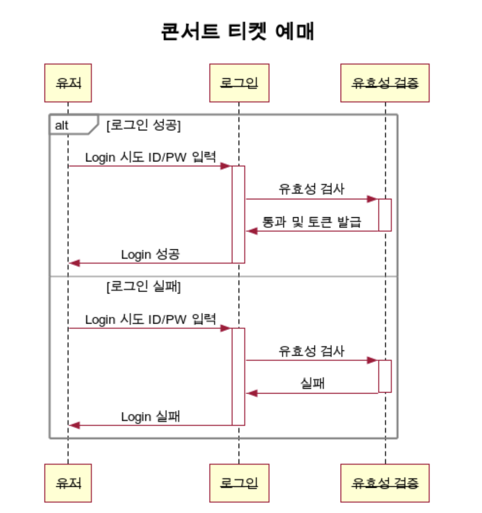
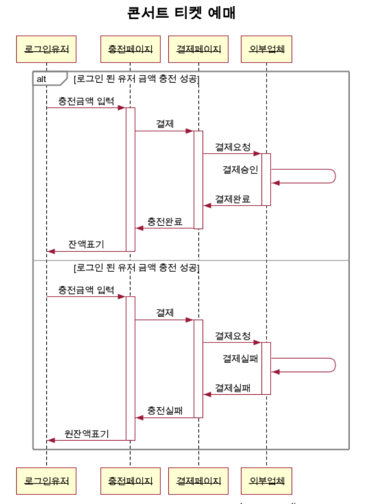
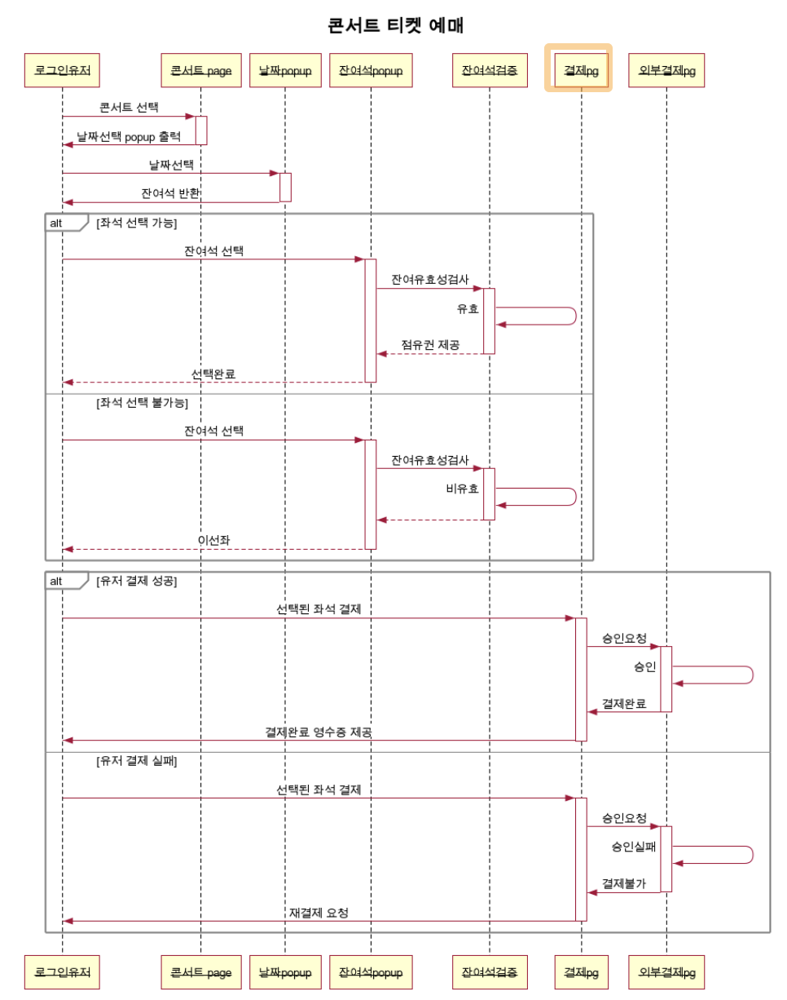
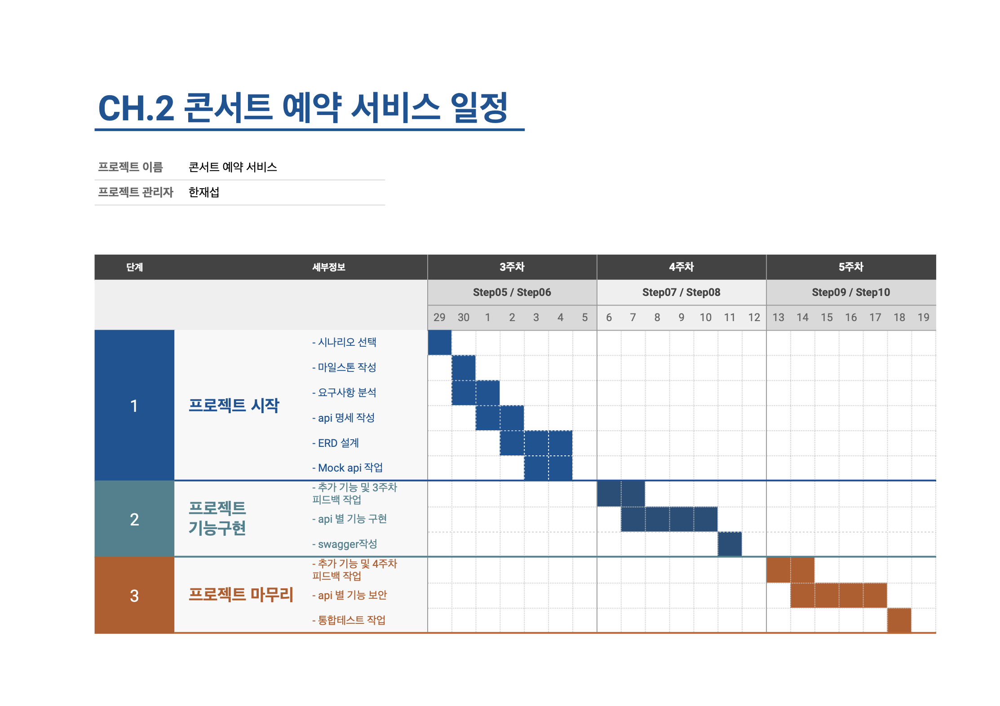

# API 명세서

## 개요

이 API는 콘서트 예약 서비스의 RESTful API입니다.

## 기본 URL

`https://api.example.com/v1`

## 인증

API 요청에는 모든 엔드포인트에 대해 Bearer Token 인증이 필요합니다.

<details>
  <summary><span style="font-size: 1.5em;">API Spec</span></summary>

### 유저 토큰 발급 API

- 로그인
- 로그아웃
- 유저 조회
- 유저 전체 조회
<!-- - 토큰 발급 -->

### 예약 가능 날짜 / 좌석 API

- 콘서트 조회
- 콘서트 등록
- 콘서트 삭제
- 예약 가능 날짜 조회
- 예약 가능 날짜 별 좌석 조회

### 좌석 예약 요청 API

- 예약 가능 날짜 별 좌석 예약
- 좌석 예약 취소 요청

### 잔액 충전 / 조회 API

- 잔액 조회
- 잔액 충전

### 결제 API

- 결제 요청
</details>

<details>
  <summary><span style="font-size: 1.5em;">엔드포인트</span></summary>

### 유저 토큰 발급 API

#### 로그인

##### EndPoint

- **URL**: `/login`
- **Method**: `POST`
- **Description**: 로그인 기능

##### Request

- **Headers**:
  - `Authorization`: `Bearer {token}`
  - `Content-Type`: `application/json`
- **Body**:
  ```json
  {
    "userId": "string",
    "password": "string"
  }
  ```

##### Response

- **Success(201)**:
  ```json
  {
    "userId": "string",
    "token": "jwt토큰"
  }
  ```
- **Error(400)**:
  ```json
  {
    "error": "400",
    "message": "Invalid input data"
  }
  ```

##### Error

- 400 : 잘못된 요청
- 401 : 인증 실패
- 403 : 접근 권한 없음
- 404 : 리소스 없음
- 500 : 서버 오류

#### 로그아웃

##### EndPoint

- **URL**: `/logout`
- **Method**: `POST`
- **Description**: 로그아웃 기능

##### Request

- **Headers**:
  - `Authorization`: `Bearer {token}`
  - `Content-Type`: `application/json`
- **Body**:
  ```json
  {
    "userId": "string"
  }
  ```

##### Response

- **Success(201)**:
  ```json
  {
    "token": null
  }
  ```

#### 유저 조회

##### EndPoint

- **URL**: `/getUserInfo`
- **Method**: `POST`
- **Description**: 특정 유저 조회

##### Request

- **Headers**:
  - `Authorization`: `Bearer {token}`
  - `Content-Type`: `application/json`
- **Body**:
  ```json
  {
    "userId": "string"
  }
  ```

##### Response

- **Success(201)**:
  ```json
  {
    "userId": "string",
    "userName": "string",
    "userEmail": "string",
    "token": "string"
  }
  ```
- **Error(404)**:
  ```json
  {
    "error": 404,
    "message": "Not found"
  }
  ```

#### 유저 전체 조회

##### EndPoint

- **URL**: `/getUserInfoAll`
- **Method**: `POST`
- **Description**: 전체 유저 조회

##### Request

- **Headers**:
  - `Authorization`: `Bearer {token}`
  - `Content-Type`: `application/json`
- **Body**:
  ```json
  {
    "userId": "string"
  }
  ```

##### Response

- **Success(201)**:
  ```json
  [
    {
      "userId": "string",
      "userName": "string",
      "userEmail": "string",
      "token": "string"
    },
    {
      "userId": "string",
      "userName": "string",
      "userEmail": "string",
      "token": "string"
    },
    {
      "userId": "string",
      "userName": "string",
      "userEmail": "string",
      "token": "string"
    }
  ]
  ```
- **Error(404)**:
  ```json
  {
    "error": 404,
    "message": "Not found"
  }
  ```

<!-- #### 유저 토큰 발급

##### EndPoint

- **URL**: `/setToken`
- **Method**: `POST`
- **Description**: 토큰 발급

##### Request

- **Headers**:
  - `Authorization`: `Bearer {token}`
  - `Content-Type`: `application/json`
- **Body**:
  ```json
  {
    "userId": "string"
  }
  ```

##### Response

- **Success(201)**:
  ```json
  {
    "userId": "string",
    "token": "string"
  }
  ``` -->

### 예약 가능 날짜 / 좌석 API

#### 콘서트 조회

##### EndPoint

- **URL**: `/getConcertAll`
- **Method**: `POST`
- **Description**: 전체 콘서트를 조회

##### Request

- **Headers**:
  - `Authorization`: `Bearer {token}`
  - `Content-Type`: `application/json`
- **Body**:
  ```json
  {
    "concertName": "string"
  }
  ```

##### Response

- **Success(201)**:

  ```json
  [
    {
      "concertName" : "string",
      "concertOpenedDate" : "dateTime",
      "concertClosedDate" : "dateTime",
      "concertMaxCapacity" : number,
      "concertApplyCapacity" : number
    },
    {
      "concertName" : "string",
      "concertOpenedDate" : "dateTime",
      "concertClosedDate" : "dateTime",
      "concertMaxCapacity" : number,
      "concertApplyCapacity" : number
    }
  ]

  ```

- **Error(404)**:
  ```json
  {
    "error": "404",
    "message": "Not Found"
  }
  ```

#### 콘서트 등록

##### EndPoint

- **URL**: `/setConcert`
- **Method**: `POST`
- **Description**: 콘서트 등록

##### Request

- **Headers**:
  - `Authorization`: `Bearer {token}`
  - `Content-Type`: `application/json`
- **Body**:
  ```json
  {
    "concertName" : "string",
    "concertOpenedDate" : "dateTime",
    "concertClosedDate" : "dateTime",
    "concertMaxCapacity" : number
  }
  ```

##### Response

- **Success(201)**:

  ```json
  {
    "concertId": number,
    "concertName" : "string",
    "concertOpenedDate" : "dateTime",
    "concertClosedDate" : "dateTime",
    "concertMaxCapacity" : number,
    "concertApplyCapacity" : number
  }
  ```

#### 콘서트 삭제

##### EndPoint

- **URL**: `/delConcert`
- **Method**: `POST`
- **Description**: 콘서트 삭제

##### Request

- **Headers**:

  - `Authorization`: `Bearer {token}`
  - `Content-Type`: `application/json`

- **Body**:
  ```json
  {
    "concertName": "string",
    "concertOpenDate": "dateTime"
  }
  ```

##### Response

- **Success(201)**:

  ```json
  {
    "result" : boolean
  }
  ```

- **Error(404)**:
  ```json
  {
    "error": "404",
    "message": "Not Found"
  }
  ```

#### 예약 가능 날짜 조회

##### EndPoint

- **URL**: `/getConcertDate`
- **Method**: `POST`
- **Description**: 예약 가능 날짜 조회

##### Request

- **Headers**:

  - `Authorization`: `Bearer {token}`
  - `Content-Type`: `application/json`

- **Body**:
  ```json
  {
    "concertId" : number
  }
  ```

##### Response

- **Success(201)**:

  ```json
  [
    {
      "concertOptionId" : number,
      "concertOpenedDate" : dateTime
    },
    {
      "concertOptionId" : number,
      "concertOpenedDate" : dateTime
    },
    {
      "concertOptionId" : number,
      "concertOpenedDate" : dateTime
    },
    {
      "concertOptionId" : number,
      "concertOpenedDate" : dateTime
    }
  ]
  ```

- **Error(404)**:
  ```json
  {
    "error": "404",
    "message": "Not Found"
  }
  ```

#### 예약 가능 날짜 별 좌석 조회

##### EndPoint

- **URL**: `/getConcertDateToCapacity`
- **Method**: `POST`
- **Description**: 예약 가능 날짜 별 좌석 조회

##### Request

- **Headers**:

  - `Authorization`: `Bearer {token}`
  - `Content-Type`: `application/json`

- **Body**:
  ```json
  {
    "concertOptionId" : number,
    "concertOpenedDate" : dateTime
  }
  ```

##### Response

- **Success(201)**:

  ```json
  [
    {
      "concertOptionId" : number,
      "concertSeatNumber" : [number, number, number]
    },
    {
      "concertOptionId" : number,
      "concertSeatNumber" : [number, number, number]
    },
    {
      "concertOptionId" : number,
      "concertSeatNumber" : [number, number, number]
    },
    {
      "concertOptionId" : number,
      "concertSeatNumber" : [number, number, number]
    }
  ]
  ```

- **Error(404)**:
  ```json
  {
    "error": "404",
    "message": "Not Found"
  }
  ```

### 좌석 예약 요청 API

#### 예약 가능 날짜 별 좌석 예약

##### EndPoint

- **URL**: `/setConcertDateToCapacity`
- **Method**: `POST`
- **Description**: 예약 가능 날짜 별 좌석 예약

##### Request

- **Headers**:

  - `Authorization`: `Bearer {token}`
  - `Content-Type`: `application/json`

- **Body**:
  ```json
  {
    "concertOptionId" : number,
    "concertOpenedDate" : dateTime,
    "concertSeatNumber" : number
  }
  ```

##### Response

- **Success(201)**:

  ```json
  [
    {
      "concertOptionId" : number,
      "concertSeatNumber" : [number, number, number]
    },
    {
      "concertOptionId" : number,
      "concertSeatNumber" : [number, number, number]
    },
    {
      "concertOptionId" : number,
      "concertSeatNumber" : [number, number, number]
    },
    {
      "concertOptionId" : number,
      "concertSeatNumber" : [number, number, number]
    }
  ]
  ```

- **Error(404)**:
  ```json
  {
    "error": "404",
    "message": "Not Found"
  }
  ```

#### 좌석 예약 취소 요청

##### EndPoint

- **URL**: `/delConcertDateToCapacity`
- **Method**: `POST`
- **Description**: 좌석 예약 취소 요청

##### Request

- **Headers**:

  - `Authorization`: `Bearer {token}`
  - `Content-Type`: `application/json`

- **Body**:
  ```json
  {
    "concertOptionId" : number,
    "concertOpenedDate" : dateTime,
    "concertSeatNumber" : number
  }
  ```

##### Response

- **Success(201)**:

  ```json
  {
    "result": boolean
  }
  ```

- **Error(404)**:
  ```json
  {
    "error": "404",
    "message": "Not Found"
  }
  ```

### 잔액 충전 / 조회 API

#### 잔액 조회

##### EndPoint

- **URL**: `/getAmount`
- **Method**: `POST`
- **Description**: 잔액 조회

##### Request

- **Headers**:

  - `Authorization`: `Bearer {token}`
  - `Content-Type`: `application/json`

- **Body**:
  ```json
  {
    "userId": "string"
  }
  ```

##### Response

- **Success(201)**:

  ```json
  {
    "userId": "string",
    "userAmount": number
  }
  ```

#### 잔액 충전

##### EndPoint

- **URL**: `/setAmount`
- **Method**: `POST`
- **Description**: 잔액 충전

##### Request

- **Headers**:

  - `Authorization`: `Bearer {token}`
  - `Content-Type`: `application/json`

- **Body**:
  ```json
  {
    "userId" : "string",
    "chargeAmount" : number
  }
  ```

##### Response

- **Success(201)**:

  ```json
  {
    "userId": "string",
    "userAmount": number
  }
  ```

### 결제 API

#### 결제 요청

##### EndPoint

- **URL**: `/setPayment`
- **Method**: `POST`
- **Description**: 결제 요청

##### Request

- **Headers**:

  - `Authorization`: `Bearer {token}`
  - `Content-Type`: `application/json`

- **Body**:
  ```json
  {
    "userId": "string"
  }
  ```

##### Response

- **Success(201)**:

  ```json
  {
    "userId": "string",
    "userAmount": number
  }
  ```

- **Error(500)**:

  ```json
  {
    "error": "500",
    "message": "금액이 부족합니다".
  }
  ```

  </details>

<details>
  <summary><span style="font-size: 1.5em;">시퀀스 다이어그램</span></summary>
  
  - 로그인 시나리오
  
  
  - 충전 시나리오
  

- 콘서트 예약 시나리오
  

</details>

<details>
  <summary><span style="font-size: 1.5em;">마일스톤 정리</span></summary>
  
  

</details>
