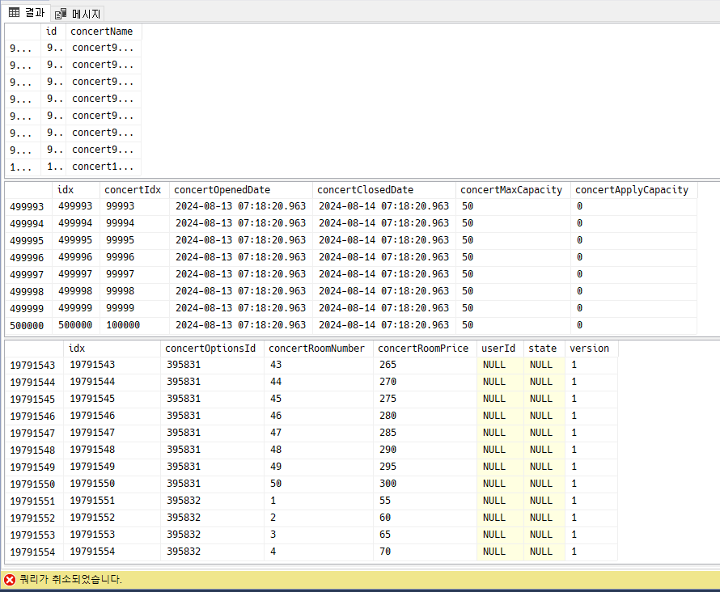

# API 명세서

## 개요

이 API는 콘서트 예약 서비스의 RESTful API입니다.

## 기본 URL

<!-- `https://api.example.com/v1` -->

## 인증

API 요청에는 모든 엔드포인트에 대해 Bearer Token 인증이 필요합니다.

<details>
  <summary><span style="font-size: 1.5em;">K6 부하테스트 장애 대응</span></summary>
# 부하 테스트 결과 및 개선 계획

## 개요

이 문서는 `ticatch` 프로젝트의 주요 기능에 대한 부하 테스트 결과를 정리한 것입니다. 이번 테스트는 콘서트 조회, 유저 생성, 충전 금액 조회, 예약 상태 조회 등의 API 성능을 평가하기 위해 진행되었습니다. 테스트의 목표는 50명의 가상 사용자가 2분 동안 지속적으로 요청을 보냈을 때 시스템이 어떻게 동작하는지를 확인하는 것입니다.

### 테스트 환경

- **사용 도구:** K6 (버전 0.53.0)
- **최대 가상 사용자(VUs):** 50명
- **테스트 기간:** 2분
- **테스트 시나리오:**
  - 콘서트 조회
  - 유저 생성
  - 충전 금액 조회
  - 예약 상태 조회

## 테스트 결과 요약

### 성공한 요청:

- **콘서트 조회:** 686건 성공 (status 200)
- **충전 금액 조회:** 686건 성공 (status 200)
- **예약 상태 조회:** 686건 성공 (status 200)

### 실패한 요청:

- **유저 생성:** 686건 실패 (status 201 미반환)

### 전체 성능 지표:

- **성공률:** 75.00% (2058건 성공, 686건 실패)
- **데이터 전송량:** 송신 345 kB, 수신 7.3 MB
- **평균 응답 시간:** 990.45 µs
- **최대 응답 시간:** 7.18 ms
- **HTTP 요청 실패율:** 25.00%

## 문제 분석

### 1. 유저 생성 실패:
- **데이터 유효성 문제:** 유저 생성에 필요한 필드가 누락되었거나, 잘못된 데이터 형식이 포함되었을 가능성이 있습니다.
- **중복된 데이터 문제:** 테스트 중 동일한 유저 ID나 이메일이 중복되어 생성 오류가 발생했을 수 있습니다.
- **서버 측 문제:** 서버에서 유저 생성 요청을 처리하는 동안 내부 오류가 발생했거나, 201 상태 코드 대신 다른 상태 코드가 반환되었을 가능성이 있습니다.

### 2. 요청 처리 속도:
- 전체적으로 응답 시간이 빠르며, 대부분의 요청이 1ms 이내에 처리되었습니다. 그러나 유저 생성의 실패로 인해 전체 테스트의 성공률이 75%로 떨어졌습니다.

## 개선안

### 1. 유저 생성 요청 문제 해결:
- **중복 방지:** 유저 생성 시 고유한 ID 및 이메일을 생성하는 로직을 개선하여 중복이 발생하지 않도록 합니다.
- **서버 로그 분석:** 서버 로그를 확인하여 유저 생성 요청이 왜 실패했는지 구체적인 원인을 파악합니다.
- **응답 처리 개선:** K6 스크립트에서 유저 생성 요청이 실패할 경우 해당 응답 내용을 기록하도록 추가하여 문제를 보다 쉽게 추적할 수 있습니다.

### 2. 서버 최적화 및 캐싱:
- **캐싱 도입:** 자주 조회되는 데이터에 대해 캐싱을 적용하여 서버의 부하를 줄입니다.
- **비동기 처리:** 유저 생성과 같은 I/O 작업을 비동기로 처리하여 서버 응답 시간을 줄일 수 있습니다.

### 3. 추가 테스트:
- **스테이징 환경에서의 재테스트:** 개선 후 스테이징 환경에서 다시 부하 테스트를 진행하여 문제 해결 여부를 확인합니다.
- **다양한 시나리오 테스트:** 다양한 사용자 시나리오와 부하 상황에서 성능을 평가하기 위해 추가적인 테스트를 수행합니다.

## 대응 방안

### 1. 문제 발생 시 대응 방안:
- **모니터링 강화:** 부하 테스트 중 발생한 문제를 실시간으로 모니터링하고, 문제가 발생한 경우 즉시 알림을 받을 수 있는 시스템을 구축합니다.
- **페일오버 전략:** 서버가 과부하 상태에 도달했을 경우, 자동으로 백업 서버로 전환하거나, 일정한 트래픽을 분산 처리할 수 있도록 페일오버 전략을 마련합니다.
- **비상 대응 계획:** 테스트 중 발생할 수 있는 다양한 장애 상황에 대한 비상 대응 계획을 수립합니다.

### 2. 장기적 개선 방안:
- **지속적인 성능 최적화:** 주기적으로 부하 테스트를 수행하여 서버 성능을 최적화하고, 성능 문제를 사전에 예방합니다.
- **서버 인프라 확장:** 트래픽 증가에 대비해 서버 인프라를 확장할 계획을 수립합니다. 필요한 경우 클라우드 서비스의 오토스케일링 기능을 활용할 수 있습니다.

## 결론

이번 부하 테스트에서 유저 생성 API의 실패로 인해 전체 성공률이 75%로 떨어졌습니다. 해당 문제를 해결하기 위해 서버 로그를 분석하고, 유저 생성 로직을 개선할 필요가 있습니다. 이와 함께 캐싱, 비동기 처리 등을 통한 서버 최적화 작업도 고려할 수 있습니다. 이러한 개선 작업 후 추가적인 부하 테스트를 수행하여 성능을 재평가하고, 문제가 해결되었는지 확인해야 합니다.

**향후 계획:**
- 유저 생성 API 문제 해결 후 재테스트 수행
- 성능 최적화를 위한 추가 작업 및 테스트
- 테스트 자동화를 통한 지속적인 모니터링 체계 구축
</details>

<details>
  <summary><span style="font-size: 1.5em;">시나리오 Query 분석 및 Index 설계</span></summary>
  
  

#### 각 테이블 별 데이터 raw 수

- 콘서트 : 100k
- 콘서트 상세정보 : 500k
- 콘서트 좌석정보 : 약 19m

#### 인덱스 설정 전 실행시간

- 전체 콘서트 조회
  - 1차 : ConcertFindTime: 2:59.348 (m:ss.mmm)
  - 2차 : ConcertFindTime: 3:04.563 (m:ss.mmm)

#### 인덱스 작업 범주 고민

1. 조회 조건 파악

   ```
     .select([
       'CD.concertIdx',
       'CD.concertOpenedDate',
       'CD.concertClosedDate',
       'CD.concertMaxCapacity',
       'CD.concertApplyCapacity',
     ])
     .where('CD.concertIdx IN (:...idx)', { idx: batchIds })
     .andWhere('CD.concertOpenedDate >= :date', { date: today })
     .getMany();
   ```

   - idx 와 열린 시간

2. 실행계획 분석
   

   - index Scan...?
   - 그럼 인덱스를 거는 의미가 있나?

3. index 설정

   - 1차 인덱스 생성
     ```
       CREATE INDEX idx_concert_options ON ConcertOptions(concertIdx, concertOpenedDate);
     ```
     및 기존 인덱스 비활성화
     ```
       ALTER INDEX PK_421c23368f8f09694d4fc858a9d ON Concert DISABLE;
     ```

#### 인덱스 설정 후 실행시간

- 전체 콘서트 조회 : ConcertFindTime: 3:02.229 (m:ss.mmm)

#### 결과

- 이미 걸려있는 PK 인덱스로 인해 추가 인덱스는 불필요해보인다.

</details>

<details>
  <summary><span style="font-size: 1.5em;">MSA 설계 및 트랜잭션 처리</span></summary>
  
#### MSA 설계

##### 1. 기존 모듈들을 MSA로 설계한다면.

- 유저 모듈
- 대기열 모듈
- 예약 모듈
- 결제모듈
- 콘서트 모듈

##### 2. 각 모듈 별 트랜잭션이 물려있는 부분을 확인

- 결제 모듈 + 유저(금액) + 대기열
- 콘서트(인원) + 예약

##### 3. CQRS Event 로 해당 트랜잭션에 Command 와 Handler 적용

- 결제 관련 로직이 외부 API랑 통신한다고 가정
- Event 관련 작업을 진행
- 미비한 Payment 로직 추가 작업

</details>

<details>
  <summary><span style="font-size: 1.5em;">캐시 전략 관련 보고서</span></summary>

### 캐시 전략 분석

#### 1. 캐싱이란 \*nest.js 공식문서 발췌

    - 캐싱은 앱의 성능을 향상시킬 수 있는 훌륭하면서도 간단한 테크닉 입니다.
    - 캐싱은 고성능 데이터 액세스를 제공하는 임시 데이터 저장소 역할을 합니다.

#### 2. 캐싱의 필요성

    (1) DB I/O 를 줄인다.
    (2) 응답시간을 단축시킨다.
      - 현재 API 중 가장 DB I/O가 빈번하게 일어날 것 같은 API -> 콘서트 조회 API

#### 3. 콘서트 조회 API

    - API 조회 되는 시점에서 Cache 생성
    - 콘서트 및 상세내용이 수정 되는 시점에서 Cache 폭파
    - API 조회 시 Cache 확인, Cache가 존재하지 않는 경우 신규 Cache 보여주기

#### 개발된 API 중 콘서트 조회 API만 선택한 이유

    1. 고려된 API는 총 3가지
      1) 콘서트 조회
      2) 유저 데이터 조회
        - 현업에서 유저 정보의 경우 userName이나 세션 ID같은 부분을 암호화로 FE에 제공하는 것으로 이해
      3) 대기열
        - 대기열을 redis로 변경했기 때문에 캐싱을 하는 것은 의미 없는 짓이라고 생각함.

</details>

<details>
  <summary><span style="font-size: 1.5em;">유즈케이스 분석 자료</span></summary>

### 유즈케이스 분석

- 유저 대기열 토큰 발급

  - 문제 : 다수의 유저가 동시에 대기열 토큰을 요청할 경우, 동일한 대기 순서가 부여되거나 데이터 충돌이 발생할 수 있습니다.
  - 해결 : 대기열의 경우 분산환경, 데이터 일관성, 성능 유지를 위해 Redis의 Simple lock를 고려했습니다.
  - 추가 : Redis 서버 에러를 고려해야 한다는 생각도 하는중입니다.

- 좌석 예약 요청

  - 문제 : 동일한 좌석에 대해 다수의 유저가 동시에 예약 요청을 할 경우, 두 명 이상의 유저에게 동일한 좌석이 임시 예약 상태로 제공될 수 있습니다.
  - 해결 : 충돌 빈도가 토큰 발급 보다 상대적으로 낮다고 생각, 낙관락 + 재시도를 통해 최적화를 진행하는 것 고려했습니다.

- 결제 API
  - 문제 : 동일한 좌석에 대해 다수의 유저가 결제 요청을 할 경우, 두 명 이상의 유저에게 동일한 좌석이 결제 완료 상태로 배정될 수 있습니다.
  - 해결 : 결제의 경우 데이터 일관성을 보장 하기 위해 비관락을 고려했습니다.

</details>

<details>
  <summary><span style="font-size: 1.5em;">API Spec</span></summary>

### 유저 토큰 발급 API

- 로그인
- 로그아웃
- 유저 조회
- 유저 전체 조회
<!-- - 토큰 발급 -->

### 예약 가능 날짜 / 좌석 API

- 콘서트 조회
- 콘서트 등록
- 콘서트 삭제
- 예약 가능 날짜 조회
- 예약 가능 날짜 별 좌석 조회

### 좌석 예약 요청 API

- 예약 가능 날짜 별 좌석 예약
- 좌석 예약 취소 요청

### 잔액 충전 / 조회 API

- 잔액 조회
- 잔액 충전

### 결제 API

- 결제 요청
</details>

<details>
  <summary><span style="font-size: 1.5em;">엔드포인트</span></summary>

### 유저 토큰 발급 API

#### 로그인

##### EndPoint

- **URL**: `/login`
- **Method**: `POST`
- **Description**: 로그인 기능

##### Request

- **Headers**:
  - `Authorization`: `Bearer {token}`
  - `Content-Type`: `application/json`
- **Body**:
  ```json
  {
    "userId": "string",
    "password": "string"
  }
  ```

##### Response

- **Success(201)**:
  ```json
  {
    "userId": "string",
    "token": "jwt토큰"
  }
  ```
- **Error(400)**:
  ```json
  {
    "error": "400",
    "message": "Invalid input data"
  }
  ```

##### Error

- 400 : 잘못된 요청
- 401 : 인증 실패
- 403 : 접근 권한 없음
- 404 : 리소스 없음
- 500 : 서버 오류

#### 로그아웃

##### EndPoint

- **URL**: `/logout`
- **Method**: `POST`
- **Description**: 로그아웃 기능

##### Request

- **Headers**:
  - `Authorization`: `Bearer {token}`
  - `Content-Type`: `application/json`
- **Body**:
  ```json
  {
    "userId": "string"
  }
  ```

##### Response

- **Success(201)**:
  ```json
  {
    "token": null
  }
  ```

#### 유저 조회

##### EndPoint

- **URL**: `/getUserInfo`
- **Method**: `POST`
- **Description**: 특정 유저 조회

##### Request

- **Headers**:
  - `Authorization`: `Bearer {token}`
  - `Content-Type`: `application/json`
- **Body**:
  ```json
  {
    "userId": "string"
  }
  ```

##### Response

- **Success(201)**:
  ```json
  {
    "userId": "string",
    "userName": "string",
    "userEmail": "string",
    "token": "string"
  }
  ```
- **Error(404)**:
  ```json
  {
    "error": 404,
    "message": "Not found"
  }
  ```

#### 유저 전체 조회

##### EndPoint

- **URL**: `/getUserInfoAll`
- **Method**: `POST`
- **Description**: 전체 유저 조회

##### Request

- **Headers**:
  - `Authorization`: `Bearer {token}`
  - `Content-Type`: `application/json`
- **Body**:
  ```json
  {}
  ```

##### Response

- **Success(201)**:
  ```json
  [
    {
      "userId": "string",
      "userName": "string",
      "userEmail": "string",
      "token": "string"
    },
    {
      "userId": "string",
      "userName": "string",
      "userEmail": "string",
      "token": "string"
    },
    {
      "userId": "string",
      "userName": "string",
      "userEmail": "string",
      "token": "string"
    }
  ]
  ```
- **Error(404)**:
  ```json
  {
    "error": 404,
    "message": "Not found"
  }
  ```

<!-- #### 유저 토큰 발급

##### EndPoint

- **URL**: `/setToken`
- **Method**: `POST`
- **Description**: 토큰 발급

##### Request

- **Headers**:
  - `Authorization`: `Bearer {token}`
  - `Content-Type`: `application/json`
- **Body**:
  ```json
  {
    "userId": "string"
  }
  ```

##### Response

- **Success(201)**:
  ```json
  {
    "userId": "string",
    "token": "string"
  }
  ``` -->

### 예약 가능 날짜 / 좌석 API

#### 콘서트 조회

##### EndPoint

- **URL**: `/getConcert`
- **Method**: `POST`
- **Description**: 전체 콘서트를 조회

##### Request

- **Headers**:
  - `Authorization`: `Bearer {token}`
  - `Content-Type`: `application/json`
- **Body**:
  ```json
  {
    "concertName": "string"
  }
  ```

##### Response

- **Success(201)**:

  ```json
  [
    {
      "concertName" : "string",
      "concertOpenedDate" : "dateTime",
      "concertClosedDate" : "dateTime",
      "concertMaxCapacity" : number,
      "concertApplyCapacity" : number
    },
    {
      "concertName" : "string",
      "concertOpenedDate" : "dateTime",
      "concertClosedDate" : "dateTime",
      "concertMaxCapacity" : number,
      "concertApplyCapacity" : number
    }
  ]

  ```

- **Error(404)**:
  ```json
  {
    "error": "404",
    "message": "Not Found"
  }
  ```

#### 콘서트 등록

##### EndPoint

- **URL**: `/setConcert`
- **Method**: `POST`
- **Description**: 콘서트 등록

##### Request

- **Headers**:
  - `Authorization`: `Bearer {token}`
  - `Content-Type`: `application/json`
- **Body**:
  ```json
  {
    "concertName" : "string",
    "concertOpenedDate" : "dateTime",
    "concertClosedDate" : "dateTime",
    "concertMaxCapacity" : number
  }
  ```

##### Response

- **Success(201)**:

  ```json
  {
    "concertId": number,
    "concertName" : "string",
    "concertOpenedDate" : "dateTime",
    "concertClosedDate" : "dateTime",
    "concertMaxCapacity" : number,
    "concertApplyCapacity" : number
  }
  ```

#### 콘서트 삭제

##### EndPoint

- **URL**: `/delConcert`
- **Method**: `POST`
- **Description**: 콘서트 삭제

##### Request

- **Headers**:

  - `Authorization`: `Bearer {token}`
  - `Content-Type`: `application/json`

- **Body**:
  ```json
  {
    "concertName": "string",
    "concertOpenDate": "dateTime"
  }
  ```

##### Response

- **Success(201)**:

  ```json
  {
    "result" : boolean
  }
  ```

- **Error(404)**:
  ```json
  {
    "error": "404",
    "message": "Not Found"
  }
  ```

#### 예약 가능 날짜 조회

##### EndPoint

- **URL**: `/getConcertDate`
- **Method**: `POST`
- **Description**: 예약 가능 날짜 조회

##### Request

- **Headers**:

  - `Authorization`: `Bearer {token}`
  - `Content-Type`: `application/json`

- **Body**:
  ```json
  {
    "concertName": "string"
  }
  ```

##### Response

- **Success(201)**:

  ```json
  [
    {
      "concertName" : "string",
      "concertOpenedDate" : dateTime
    },
    {
      "concertName" : "string",
      "concertOpenedDate" : dateTime
    },
    {
      "concertName" : "string",
      "concertOpenedDate" : dateTime
    },
    {
      "concertName" : "string",
      "concertOpenedDate" : dateTime
    }
  ]
  ```

- **Error(404)**:
  ```json
  {
    "error": "404",
    "message": "Not Found"
  }
  ```

#### 예약 가능 날짜 별 좌석 조회

##### EndPoint

- **URL**: `/getConcertDateToCapacity`
- **Method**: `POST`
- **Description**: 예약 가능 날짜 별 좌석 조회

##### Request

- **Headers**:

  - `Authorization`: `Bearer {token}`
  - `Content-Type`: `application/json`

- **Body**:
  ```json
  {
    "concertName" : "string",
    "concertOpenedDate" : dateTime
  }
  ```

##### Response

- **Success(201)**:

  ```json
  [
    {
      "concertName" : "string",
      "concertOpenedDate" : dateTime,
      "concertSeatNumber" : [ number, number, number ]
    }
  ]
  ```

- **Error(404)**:
  ```json
  {
    "error": "404",
    "message": "Not Found"
  }
  ```

### 좌석 예약 요청 API

#### 예약 가능 날짜 별 좌석 예약

##### EndPoint

- **URL**: `/setConcertDateToCapacity`
- **Method**: `POST`
- **Description**: 예약 가능 날짜 별 좌석 예약

##### Request

- **Headers**:

  - `Authorization`: `Bearer {token}`
  - `Content-Type`: `application/json`

- **Body**:
  ```json
  {
    "concertname" : string,
    "concertOpenedDate" : dateTime,
    "concertSeatNumber" : number
  }
  ```

##### Response

- **Success(201)**:

  ```json
  {
    "result" : boolean
  }
  ```

- **Error(404)**:
  ```json
  {
    "error": "404",
    "message": "Not Found"
  }
  ```

#### 좌석 예약 취소 요청

##### EndPoint

- **URL**: `/delConcertDateToCapacity`
- **Method**: `POST`
- **Description**: 좌석 예약 취소 요청

##### Request

- **Headers**:

  - `Authorization`: `Bearer {token}`
  - `Content-Type`: `application/json`

- **Body**:
  ```json
  {
    "concertName" : string,
    "concertOpenedDate" : dateTime,
    "concertSeatNumber" : number
  }
  ```

##### Response

- **Success(201)**:

  ```json
  {
    "result": boolean
  }
  ```

- **Error(404)**:
  ```json
  {
    "error": "404",
    "message": "Not Found"
  }
  ```

### 잔액 충전 / 조회 API

#### 잔액 조회

##### EndPoint

- **URL**: `/getAmount`
- **Method**: `POST`
- **Description**: 잔액 조회

##### Request

- **Headers**:

  - `Authorization`: `Bearer {token}`
  - `Content-Type`: `application/json`

- **Body**:
  ```json
  {
    "userId": "string"
  }
  ```

##### Response

- **Success(201)**:

  ```json
  {
    "userId": "string",
    "userAmount": number
  }
  ```

#### 잔액 충전

##### EndPoint

- **URL**: `/setAmount`
- **Method**: `POST`
- **Description**: 잔액 충전

##### Request

- **Headers**:

  - `Authorization`: `Bearer {token}`
  - `Content-Type`: `application/json`

- **Body**:
  ```json
  {
    "userId" : "string",
    "chargeAmount" : number
  }
  ```

##### Response

- **Success(201)**:

  ```json
  {
    "userId": "string",
    "userAmount": number
  }
  ```

### 결제 API

#### 결제 요청

##### EndPoint

- **URL**: `/setPayment`
- **Method**: `POST`
- **Description**: 결제 요청

##### Request

- **Headers**:

  - `Authorization`: `Bearer {token}`
  - `Content-Type`: `application/json`

- **Body**:
  ```json
  {
    "userId": "string",
    "usingAmount": number
  }
  ```

##### Response

- **Success(201)**:

  ```json
  {
    "result": boolean
  }
  ```

- **Error(500)**:

  ```json
  {
    "error": "500",
    "message": "금액이 부족합니다".
  }
  ```

  </details>

<details>
  <summary><span style="font-size: 1.5em;">시퀀스 다이어그램</span></summary>
  
  - 로그인 시나리오
  
  
  - 충전 시나리오
  

- 콘서트 예약 시나리오
  

</details>

<details>
  <summary><span style="font-size: 1.5em;">마일스톤 정리</span></summary>
  
  

</details>

<details>
  <summary><span style="font-size: 1.5em;">ERD</span></summary>
  
  

</details>

<details>
  <summary><span style="font-size: 1.5em;">마일스톤 정리</span></summary>
  
  

</details>

<details>
  <summary><span style="font-size: 1.5em;">시나리오 분석</span></summary>
  
  ### 유저 대기열 토큰 기능
  * 유저 토큰 발급
    - 유저는 서비스에 접속하여 대기열 토큰을 요청합니다.
    - 서버는 유저의 UUID와 대기열 정보를 포함한 토큰을 생성하여 반환합니다.
    - 대기열 정보에는 대기 순서와 잔여 시간이 포함될 수 있습니다.
    - 유저는 발급받은 토큰을 이용하여 다른 API를 호출할 수 있습니다.
  
  ### 예약 가능 날짜 / 좌석 API
  * 예약 가능 날짜 조회
    - 유저는 예약 가능한 날짜 목록을 요청합니다.
    - 서버는 예약 가능한 날짜 목록을 반환합니다.
  * 예약 가능 좌석 조회
    - 유저는 특정 날짜의 예약 가능한 좌석 정보를 요청합니다.
    - 서버는 해당 날짜의 예약 가능한 좌석 정보를 반환합니다.
  
  ### 좌석 예약 요청 API
  * 좌석 예약 요청
    - 유저는 날짜와 좌석 번호를 입력하여 좌석 예약을 요청합니다.
    - 서버는 해당 좌석을 임시 예약 상태로 변경하고, 유저에게 5분 동안 임시 배정합니다.
    - 유저는 5분 내에 결제를 완료해야 합니다.
    - 5분 내에 결제가 완료되지 않으면 임시 예약이 해제되고, 다른 유저가 해당 좌석을 예약할 수 있게 됩니다.
  
  ### 잔액 충전 / 조회 API
  * 잔액 충전
    - 유저는 충전 금액을 입력하여 잔액을 충전합니다.
    - 서버는 유저의 잔액을 업데이트합니다.
  * 잔액 조회
    - 유저는 자신의 잔액을 조회합니다.
    - 서버는 유저의 잔액을 반환합니다.
  
  ### 결제 API
  * 결제 요청
    - 유저는 임시 예약된 좌석에 대한 결제를 요청합니다.
    - 서버는 유저의 잔액을 확인하고 결제를 처리합니다.
    - 결제가 완료되면 좌석 소유권을 유저에게 배정하고, 대기열 토큰을 만료시킵니다.

</details>

<details>
  <summary><span style="font-size: 1.5em;">Swagger API</span></summary>
  
  

</details>
